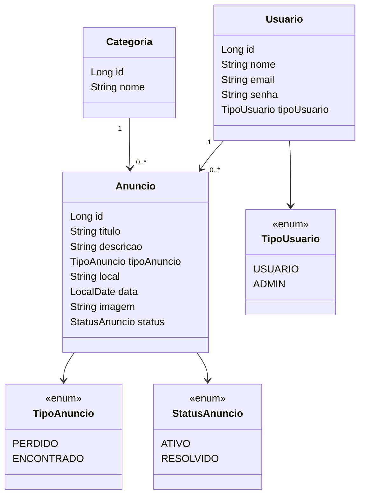

# Achados e Perdidos

Sistema web para cadastro, busca e gerenciamento de objetos perdidos ou encontrados dentro de uma instituição de ensino.

## Diagrama de Classes do Domínio

## Ferramentas Escolhidas

- **Git**: controle de versão.
- **Maven**: build e gerenciamento de dependências.
- **H2 Database**: banco em memória para desenvolvimento.
- **JavaDoc**: documentação do código Java.
- **Markdown**: documentação no README/Wiki.

## Frameworks Reutilizados

- **Spring Boot**: base da aplicação.
- **Spring Web**: criação dos controllers e rotas web.
- **Spring Data JPA**: persistência de dados.
- **Hibernate**: implementação JPA.
- **Thymeleaf**: páginas HTML dinâmicas.
- **H2 Database**: banco de dados em memória. (inicialmente para testes)

## Funcionalidades Implementadas

- Listagem inicial de anúncios ativos
- Entidades principais do domínio
- Banco H2 em memória
- Página inicial com Thymeleaf

## Funcionalidades Planejadas

- Cadastro de anúncios
- Login de usuários
- Busca e filtros
- Edição e exclusão de anúncios
- Marcar anúncio como resolvido
- Upload de imagem

## Ferramentas Planejadas

- GitHub Issues para acompanhamento de tarefas
- GitHub Actions para CI/CD
- Docker para containerização futura