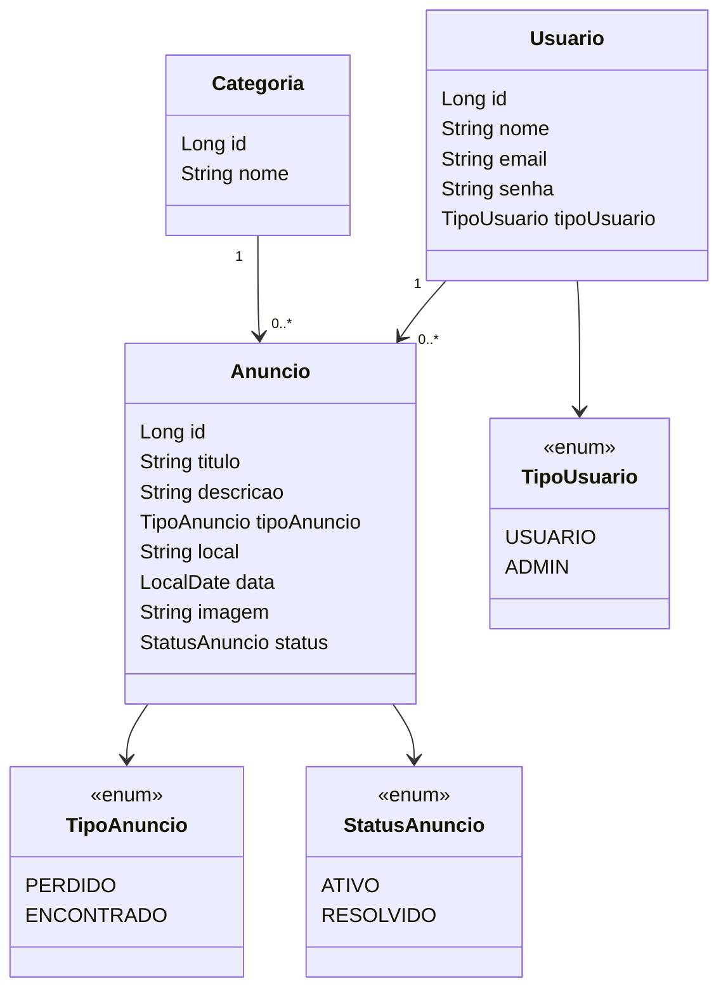

# Achados e Perdidos

Sistema web em desenvolvimento para auxiliar a comunidade da Universidade Federal do Espírito Santo (UFES) na divulgação e recuperação de objetos perdidos ou encontrados no campus.

## Descrição do Sistema

### Problema

Objetos pessoais são frequentemente perdidos ou encontrados em salas, laboratórios, bibliotecas, corredores e demais espaços da universidade. Sem um canal centralizado, a comunicação costuma acontecer de forma dispersa, por grupos de mensagens, redes sociais ou avisos informais. Isso dificulta o encontro entre quem perdeu um objeto e quem o encontrou.

O sistema de Achados e Perdidos busca centralizar essas informações em uma aplicação web. Por meio dela, a comunidade universitária poderá publicar anúncios, consultar objetos registrados e acompanhar se uma ocorrência ainda está ativa ou já foi resolvida.

### Usuários

- **Usuário comum:** integrante da comunidade universitária, como estudante, professor, servidor ou colaborador. Poderá consultar anúncios e, após autenticação, publicar e gerenciar os próprios anúncios.
- **Administrador:** responsável por acompanhar o conteúdo publicado e realizar ações administrativas quando necessário.

### Principais Funcionalidades

O escopo previsto para o sistema inclui:

- Cadastro e autenticação de usuários;
- Publicação de anúncios de objetos perdidos ou encontrados;
- Listagem e visualização dos detalhes dos anúncios;
- Busca e filtros por tipo, categoria e local;
- Edição e exclusão dos próprios anúncios;
- Inclusão de imagem do objeto;
- Marcação de anúncios como resolvidos quando o objeto for devolvido;
- Administração dos anúncios publicados.

As seções de funcionalidades implementadas e planejadas, apresentadas mais adiante, indicam o estado atual do desenvolvimento.

## Diagrama de Classes do Domínio

## Ferramentas Escolhidas

- **Git**: controle de versão.
- **Maven**: build e gerenciamento de dependências.
- **H2 Database**: banco em memória para desenvolvimento.
- **JavaDoc**: documentação do código Java.
- **Markdown**: documentação no README/Wiki.

## Frameworks Reutilizados

- **Spring Boot**: base da aplicação.
- **Spring Web**: criação dos controllers e rotas web.
- **Spring Data JPA**: persistência de dados.
- **Hibernate**: implementação JPA.
- **Thymeleaf**: páginas HTML dinâmicas.
- **H2 Database**: banco de dados em memória. (inicialmente para testes)

## Funcionalidades Implementadas

- Listagem inicial de anúncios ativos
- Cadastro inicial de anúncios via formulário
- Visualização dos detalhes dos anúncios
- Busca e filtros por texto, tipo, categoria e local
- Marcação de anúncios como resolvidos
- Histórico/listagem de anúncios resolvidos
- Entidades principais do domínio
- Banco H2 em memória
- Página inicial com Thymeleaf

## Funcionalidades Planejadas

- Login de usuários
- Edição e exclusão de anúncios
- Upload de imagem

## Ferramentas Planejadas

- GitHub Issues para acompanhamento de tarefas
- GitHub Actions para CI/CD
- Docker para containerização futura
