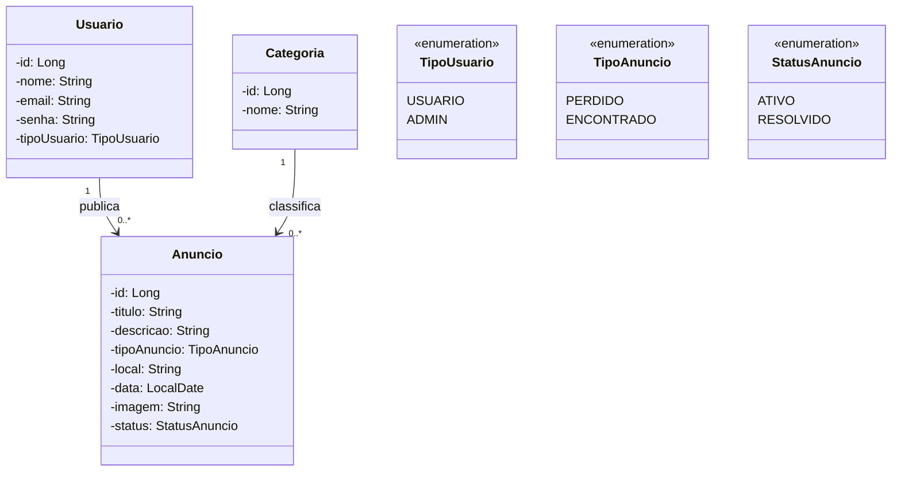

# Achados e Perdidos

Sistema web em desenvolvimento para auxiliar a comunidade da Universidade Federal do Espírito Santo (UFES) na divulgação e recuperação de objetos perdidos ou encontrados no campus.

## Descrição do Sistema

### Problema

Objetos pessoais são frequentemente perdidos ou encontrados em salas, laboratórios, bibliotecas, corredores e demais espaços da universidade. Sem um canal centralizado, a comunicação costuma acontecer de forma dispersa, por grupos de mensagens, redes sociais ou avisos informais. Isso dificulta o encontro entre quem perdeu um objeto e quem o encontrou.

O sistema de Achados e Perdidos busca centralizar essas informações em uma aplicação web. Por meio dela, a comunidade universitária poderá publicar anúncios, consultar objetos registrados e acompanhar se uma ocorrência ainda está ativa ou já foi resolvida.

### Usuários

- **Usuário comum:** integrante da comunidade universitária, como estudante, professor, servidor ou colaborador. Poderá consultar anúncios e, após autenticação, publicar e gerenciar os próprios anúncios.
- **Administrador:** responsável por acompanhar o conteúdo publicado e realizar ações administrativas quando necessário.

### Principais Funcionalidades

O escopo previsto para o sistema inclui:

- Cadastro e autenticação de usuários;
- Publicação de anúncios de objetos perdidos ou encontrados;
- Listagem e visualização dos detalhes dos anúncios;
- Busca e filtros por tipo, categoria e local;
- Edição e exclusão dos próprios anúncios;
- Inclusão de imagem do objeto;
- Marcação de anúncios como resolvidos quando o objeto for devolvido;
- Administração dos anúncios publicados.

As seções de funcionalidades implementadas e planejadas, apresentadas mais adiante, indicam o estado atual do desenvolvimento.

## Diagrama de Classes do Domínio



## Ferramentas Escolhidas

- **Git**: controle de versão.
- **GitHub Issues**: acompanhamento das tarefas e funcionalidades implementadas.
- **Maven**: build e gerenciamento de dependências.
- **H2 Database**: banco em arquivo local para desenvolvimento e demonstração.
- **JavaDoc**: documentação do código Java.
- **Markdown**: documentação no README/Wiki.


## Frameworks Reutilizados

- **Spring Security**: autenticacao, autorizacao, login/logout e protecao CSRF.
- **Spring Boot**: base da aplicação.
- **Spring Web**: criação dos controllers e rotas web.
- **Spring Data JPA**: persistência de dados.
- **Hibernate**: implementação JPA.
- **Thymeleaf**: páginas HTML dinâmicas.
- **H2 Database**: banco de dados em arquivo na aplicação e em memória nos testes automatizados.

## Como Executar

### Requisitos

- JDK 17 instalado e configurado no `PATH`
- Maven instalado e configurado no `PATH`
- Git, caso o projeto seja obtido diretamente do GitHub
- Navegador web atualizado

Verifique o ambiente antes de executar:

```bash
java -version
mvn -version
```

Os dois comandos devem indicar que o Maven está utilizando o Java 17.

### Obter o código-fonte

Clone o repositório e entre na pasta do projeto:

```bash
git clone https://github.com/Rafael-Alves233/achados-e-perdidos.git
cd achados-e-perdidos
```

Caso o projeto tenha sido recebido como arquivo compactado, extraia o conteúdo e abra o terminal na pasta que contém o arquivo `pom.xml`.

### Executar pelo Maven

Na raiz do projeto, execute:

```bash
mvn spring-boot:run
```

Na primeira execução, o Maven pode levar alguns minutos para baixar as dependências. Quando o terminal informar que a aplicação foi iniciada, acesse:

`http://localhost:8080`

Para encerrar a aplicação, pressione `Ctrl + C` no terminal.

### Executar os testes

```bash
mvn test
```

Os testes utilizam um banco H2 separado, em memória, e não alteram os dados cadastrados durante o uso normal da aplicação.

### Gerar e executar o arquivo JAR

Para executar os testes e gerar o arquivo `.jar`:

```bash
mvn clean package
```

O arquivo será criado em:

`target/achados-e-perdidos-0.0.1-SNAPSHOT.jar`

Depois, execute-o com:

```bash
java -jar target/achados-e-perdidos-0.0.1-SNAPSHOT.jar
```

Para executar um `.jar` já fornecido, apenas o Java 17 é necessário; o Maven não precisa estar instalado.

### Alterar a porta

Se a porta 8080 estiver ocupada, escolha outra porta ao executar o JAR:

```bash
java -jar target/achados-e-perdidos-0.0.1-SNAPSHOT.jar --server.port=8081
```

Nesse exemplo, a aplicação ficará disponível em `http://localhost:8081`.

### Persistência dos dados

- O banco H2 é criado na pasta `data/`.
- As imagens enviadas pelos usuários são armazenadas na pasta `uploads/`.
- As duas pastas são criadas no diretório em que a aplicação é executada.
- Para manter usuários, anúncios e imagens entre execuções, preserve essas pastas junto ao arquivo JAR.
- As pastas estão no `.gitignore`, portanto os dados locais não são enviados ao GitHub.

## Funcionalidades Implementadas

- Cadastro, login e logout de usuarios
- Listagem inicial de anúncios ativos
- Cadastro inicial de anúncios via formulário
- Visualização dos detalhes dos anúncios
- Busca e filtros por texto, tipo, categoria e local
- Página "Meus anúncios" com listagem das publicações do usuário autenticado
- Página de perfil com dados da conta, resumo dos anúncios e edição do nome
- Edição de anúncios
- Exclusão de anúncios
- Marcação de anúncios como resolvidos
- Histórico/listagem de anúncios resolvidos
- Permissao para editar, resolver e excluir apenas anuncios do proprio usuario ou por administrador
- Testes automatizados de fluxo, cenarios especificos e teste unitario de armazenamento de imagem
- Upload de imagem nos anúncios
- Remocao de imagem ao editar anuncios
- Entidades principais do domínio
- Banco H2 em arquivo para manter usuarios e anuncios apos reiniciar a aplicacao
- Página inicial com Thymeleaf
- Dados iniciais de demonstracao com administrador, usuario comum e anuncios de exemplo
- Painel administrativo com indicadores gerais e listagem de todos os anuncios

## Testes Automatizados

- Executados com `mvn test`.
- Cobrem fluxos web com Spring Boot, MockMvc, H2 em memoria e JdbcTemplate.
- Incluem cenarios especificos de upload invalido, filtros, e-mail duplicado, senhas diferentes, pagina "Meus anuncios", perfil do usuario, permissoes de edicao/resolucao/exclusao e remocao fisica de imagem.
- Incluem testes unitarios pequenos de `ImagemStorageService`, sem subir servidor, Spring ou banco.
- Incluem testes de acesso ao painel administrativo e bloqueio para usuario comum.
- Resultado atual: 35 testes, 0 falhas.

## Documentação do Código

O projeto utiliza comentários JavaDoc nas classes e operações principais. A documentação HTML é gerada pelo Maven JavaDoc Plugin configurado no arquivo `pom.xml`.

Para gerar a documentação HTML do código, execute na raiz do projeto:

```bash
mvn javadoc:javadoc
```

Após a conclusão, abra o seguinte arquivo no navegador:

`target/site/apidocs/index.html`

## Acesso de Demonstracao

- **Administrador:** secretaria@faculdade.edu
- **Senha:** 123456
- **Usuario comum:** aluno@faculdade.edu
- **Senha:** 123456

O usuario comum e criado com anuncios de exemplo sem imagem para facilitar a demonstracao da pagina "Meus anuncios".

## Funcionalidades Planejadas

- Melhorias na validacao de formularios e mensagens de erro

## Ferramentas Planejadas

- GitHub Actions para CI/CD
- Docker para containerização futura
